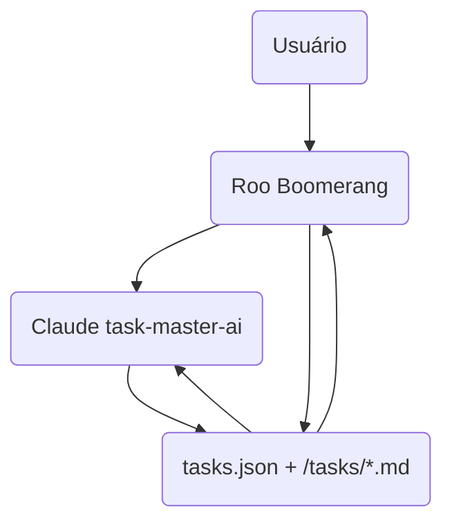
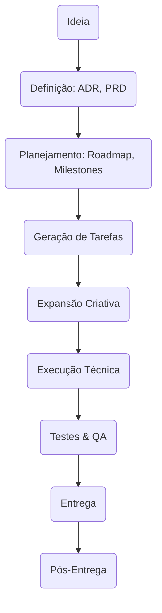

# Plano Avançado de Integração Roo Boomerang + Claude task-master-ai

**Deep Dive**

---

## Sumário

- [1. Visão Estratégica](#1-visão-estratégica)
- [2. Arquitetura Técnica Detalhada](#2-arquitetura-técnica-detalhada)
- [3. Frentes de Integração](#3-frentes-de-integração)
- [4. Casos de Uso Detalhados](#4-casos-de-uso-detalhados)
- [5. Pipeline Completo do Projeto (Game App)](#5-pipeline-completo-do-projeto-game-app)
- [6. Fluxos Técnicos e Diagramas](#6-fluxos-técnicos-e-diagramas)
- [7. Glossário e Conceitos](#7-glossário-e-conceitos)
- [8. Riscos, Limitações e Mitigações](#8-riscos-limitações-e-mitigações)
- [9. Recursos Exclusivos e Comuns](#9-recursos-exclusivos-e-comuns)
- [10. Recursos do Task Master](#10-recursos-do-task-master)

---

## 1. Visão Estratégica

- **Objetivo:** Criar um sistema híbrido que combine **controle explícito, auditável e multi-agente** (Roo Boomerang) com **autonomia criativa e rápida** (Claude task-master-ai).
- **Benefícios:**
  - Transparência + velocidade
  - Flexibilidade para tarefas técnicas e criativas
  - Padronização de tarefas e documentação
  - Orquestração multi-fase, multi-agente, multi-modal
- **Pilares:**
  - **Padronização**: arquivos, formatos, nomenclaturas
  - **Automação**: geração, expansão, execução, validação
  - **Auditabilidade**: logs, confirmações, versionamento
  - **Extensibilidade**: novos modos, agentes, integrações

---

## 2. Arquitetura Técnica Detalhada

### Componentes

- **Roo Boomerang Core**

  - Orquestrador multi-agente
  - Gerencia modos especializados
  - Invoca CLI `task-master`
  - Controla ciclo de vida das tarefas
  - Gera documentação (ADR, PRD, etc)

- **Claude task-master-ai**

  - CLI + API para criação, expansão, execução de tarefas
  - **A API MCP cobre um subconjunto das funcionalidades da CLI, focando em operações CRUD rápidas, enquanto a CLI oferece comandos avançados como parsing, geração, análise e automações.**
  - LLM-centric, autônomo
  - Atualiza `tasks.json` e `/tasks/*.md`
  - Gera subtarefas criativas

- **Repositório de Tarefas**

  - `tasks/tasks.json`: banco central
  - `/tasks/*.md`: tarefas detalhadas
  - Versionado via Git

- **Documentação**

  - `/docs/`: planos, ADRs, PRDs, retrospectivas
  - `/docs/roo-vs-taskmaster-comparativo.md`
  - `/docs/roo-taskmaster-integration-plan.md`

- **Configurações**
  - `.roomodes`, `.roo/mcp.json`, `.windsurfrules`, `.env`

---

## 3. Frentes de Integração

### 3.1. Adaptações no Roo Boomerang

- **Gerenciamento de tarefas via CLI `task-master`**
- **Parsing e validação do `tasks.json`**
- **Atualização incremental e segura**
- **Delegação inteligente** com heurísticas (complexidade, criatividade, criticidade) para decidir entre Claude e modos Roo
- **Orquestração multi-fase** (ideação, análise, planejamento, execução, validação, entrega)
- **Controle de contexto detalhado** para Claude
- **Logs e rastreabilidade detalhados**
- **Preservar delegação interna para modos especializados Roo** (Code, Architect, Debug, Ask)

---

### 3.2. Adaptações no Claude task-master-ai

- **Padronização de arquivos** para conformidade Roo
- **Expor APIs e CLI** para integração direta
- **Prompt engineering** para aceitar contexto detalhado
- **Retornar resultados estruturados**
- **Feedback loop** para status, logs, outputs
- **Permitir re-execução ou ajustes automáticos**

---

## 4. Casos de Uso Detalhados

### Caso 1: Ideação e Definição

- Usuário: "Quero criar um game, mas não sei qual"
- Roo ativa Claude para brainstorming
- Claude sugere gêneros, plataformas, tendências
- Roo organiza respostas, pede decisão
- Usuário escolhe "Puzzle casual para mobile"

---

### Caso 2: Geração de ADR e PRD

- Roo cria ADR (plataforma, engine, monetização)
- Roo cria PRD (funcionalidades, UX, KPIs)

---

### Caso 3: Planejamento e Tarefas

- Roo define milestones
- Roo usa task-master para criar tarefas macro
- Claude expande tarefas criativas
- Roo detalha tarefas técnicas

---

### Caso 4: Execução

- Roo orquestra tarefas técnicas via CLI
- Claude gera assets, diálogos, narrativa
- Roo valida entregas, atualiza status
- Claude sugere melhorias criativas

---

### Caso 5: Validação e Entrega

- Roo ativa modo Debug para testes
- Claude gera feedbacks criativos
- Roo integra, documenta, entrega

---

### Caso 6: Integração CLI + API

- Roo inicia projeto usando a CLI do task-master (`init`, `parse-prd`)
- Claude expande tarefas criativas via API MCP
- Roo consulta status e detalhes via API MCP (`listTasks`, `showTask`)
- Roo atualiza status e dependências via API MCP
- Claude sugere melhorias e expande subtarefas via API
- Roo integra resultados, valida e orquestra próximos passos

---

## 5. Pipeline Completo do Projeto (Game App)

| Fase                     | Atividades                                             | Responsável principal | Ferramentas/Modos                     |
| ------------------------ | ------------------------------------------------------ | --------------------- | ------------------------------------- |
| **Ideação**              | Brainstorm, análise mercado, definição público, gênero | Roo + Claude          | Claude (criatividade), Roo (controle) |
| **Decisão Arquitetural** | ADR: plataforma, engine, tech stack                    | Roo                   | Roo Architect Mode                    |
| **Requisitos**           | PRD: funcionalidades, UX, monetização, KPIs            | Roo                   | Roo Architect + Claude                |
| **Planejamento**         | Roadmap, milestones, WBS, backlog                      | Roo                   | Roo Architect + Code                  |
| **Geração de Tarefas**   | Criar tarefas macro, expandir em subtarefas            | Roo + Claude          | task-master CLI + Claude              |
| **Design Criativo**      | Storyline, assets, mecânicas, narrativa                | Claude                | Claude task-master-ai                 |
| **Desenvolvimento**      | Setup projeto, coding, integração, testes unitários    | Roo Code Mode         | Roo Code + task-master CLI            |
| **Testes & QA**          | Testes funcionais, UX, performance, segurança          | Roo Debug Mode        | Roo Debug + Claude                    |
| **Documentação**         | Técnicas, usuário, manutenção, retrospectiva           | Roo                   | Roo Architect + Ask                   |
| **Entrega**              | Deploy, publicação, handover                           | Roo                   | Roo Code + Architect                  |
| **Pós-Entrega**          | Feedback, melhorias, suporte                           | Roo + Claude          | Todos os modos                        |

---

## 6. Fluxos Técnicos e Diagramas

### Arquitetura Geral

---

### Pipeline Completo

---

## 7. Glossário e Conceitos

| Category                                                 | Role/Term                                       | Description                                                     |
| -------------------------------------------------------- | ----------------------------------------------- | --------------------------------------------------------------- |
| Documentação e Processo                                  | ADR                                             | Architecture Decision Record                                    |
| Documentação e Processo                                  | PRD                                             | Product Requirements Document                                   |
| Documentação e Processo                                  | WBS                                             | Work Breakdown Structure                                        |
| Documentação e Processo                                  | Backlog                                         | Lista priorizada de tarefas                                     |
| Documentação e Processo                                  | Milestone                                       | Marco importante do projeto                                     |
| Documentação e Processo                                  | Sprint                                          | Ciclo de trabalho iterativo                                     |
| Documentação e Processo                                  | MVP                                             | Minimum Viable Product                                          |
| Documentação e Processo                                  | Retrospectiva                                   | Análise pós-projeto                                             |
| Tecnologia                                               | LLM                                             | Large Language Model                                            |
| Tecnologia                                               | CLI                                             | Command Line Interface                                          |
| Tecnologia                                               | API                                             | Application Programming Interface                               |
| Infraestrutura Tradicional                               | Administrador de Redes                          | Gerencia redes locais, WAN, VPNs e conectividade geral          |
| Infraestrutura Tradicional                               | Administrador de Sistemas                       | Administra servidores físicos e virtuais, sistemas operacionais |
| Infraestrutura Tradicional                               | Analista de Suporte Técnico                     | Resolve incidentes, suporte a usuários e manutenção básica      |
| Infraestrutura Tradicional                               | Administrador de Storage                        | Gerencia armazenamento corporativo, SAN, NAS                    |
| Infraestrutura Tradicional                               | Especialista em Segurança da Informação         | Define políticas, monitora e protege ativos de TI               |
| Infraestrutura em Nuvem                                  | Cloud Architect                                 | Define arquitetura de soluções em nuvem                         |
| Infraestrutura em Nuvem                                  | Cloud Engineer                                  | Implementa e mantém ambientes em nuvem                          |
| Infraestrutura em Nuvem                                  | Especialista em Migração para Nuvem             | Planeja e executa migração de sistemas para a nuvem             |
| Infraestrutura em Nuvem                                  | FinOps Specialist                               | Otimiza custos e uso de recursos em nuvem                       |
| Infraestrutura em Nuvem                                  | Cloud Security Engineer                         | Garante segurança em ambientes cloud                            |
| DevOps e Automação                                       | DevOps Engineer                                 | Automatiza pipelines CI/CD, integra desenvolvimento e operações |
| DevOps e Automação                                       | Site Reliability Engineer (SRE)                 | Garante confiabilidade, escalabilidade e automação de sistemas  |
| DevOps e Automação                                       | Release Manager                                 | Coordena releases, versionamento e deploys                      |
| DevOps e Automação                                       | Platform Engineer                               | Desenvolve e mantém plataformas internas para desenvolvedores   |
| DevOps e Automação                                       | Infrastructure as Code Specialist               | Automatiza infraestrutura via código (Terraform, Ansible, etc.) |
| Banco de Dados e Dados                                   | Administrador de Banco de Dados (DBA)           | Gerencia bancos relacionais, performance, backup e segurança    |
| Banco de Dados e Dados                                   | Database Engineer                               | Desenvolve e otimiza soluções de banco de dados                 |
| Banco de Dados e Dados                                   | Especialista em Banco de Dados NoSQL            | Administra bancos NoSQL (MongoDB, Cassandra, etc.)              |
| Banco de Dados e Dados                                   | Data Warehouse Specialist                       | Modela e mantém data warehouses para BI                         |
| Banco de Dados e Dados                                   | DataOps Engineer                                | Automatiza pipelines de dados, integração e entrega contínua    |
| Gestão Geral                                             | Escopo                                          | Definição do que será entregue no projeto                       |
| Gestão Geral                                             | Cronograma                                      | Planejamento temporal das atividades                            |
| Gestão Geral                                             | Orçamento                                       | Planejamento e controle dos custos do projeto                   |
| Gestão Geral                                             | Stakeholders                                    | Partes interessadas no projeto                                  |
| Gestão Geral                                             | ROI                                             | Retorno sobre o investimento                                    |
| Gestão Geral                                             | OKRs                                            | Objetivos e resultados-chave para medir sucesso                 |
| Gestão Geral                                             | PMBOK                                           | Guia de boas práticas em gestão de projetos                     |
| Metodologias Ágeis                                       | Scrum                                           | Framework ágil baseado em sprints e papéis definidos            |
| Metodologias Ágeis                                       | Kanban                                          | Método ágil focado em fluxo contínuo e visualização do trabalho |
| Metodologias Ágeis                                       | Sprint                                          | Iteração de tempo fixo para entrega de incrementos              |
| Metodologias Ágeis                                       | Backlog                                         | Lista priorizada de funcionalidades e tarefas                   |
| Metodologias Ágeis                                       | Daily                                           | Reunião diária para alinhamento da equipe                       |
| Metodologias Ágeis                                       | Retrospectiva                                   | Análise pós-sprint para melhorias contínuas                     |
| Gestão de Riscos                                         | Avaliação                                       | Identificação e análise de riscos                               |
| Gestão de Riscos                                         | Mitigação                                       | Ações para reduzir a probabilidade ou impacto dos riscos        |
| Gestão de Riscos                                         | Contingência                                    | Planos alternativos caso o risco se concretize                  |
| Qualidade e Testes                                       | QA                                              | Garantia da qualidade do produto                                |
| Qualidade e Testes                                       | Testes (Unitário, Integração, Aceitação)        | Verificações em diferentes níveis do sistema                    |
| Qualidade e Testes                                       | CI/CD                                           | Integração e entrega contínuas automatizadas                    |
| Desenvolvimento Técnico                                  | Arquitetura                                     | Estrutura organizacional do sistema                             |
| Desenvolvimento Técnico                                  | Microservices                                   | Arquitetura baseada em serviços independentes                   |
| Desenvolvimento Técnico                                  | API                                             | Interface para comunicação entre sistemas                       |
| Desenvolvimento Técnico                                  | Refatoração                                     | Melhoria do código sem alterar seu comportamento                |
| Desenvolvimento Técnico                                  | Dívida Técnica                                  | Compromissos técnicos que precisam ser resolvidos futuramente   |
| Infraestrutura e Operações                               | Cloud                                           | Computação em nuvem                                             |
| Infraestrutura e Operações                               | DevOps                                          | Integração entre desenvolvimento e operações                    |
| Infraestrutura e Operações                               | IaC                                             | Infrastructure as Code, automação da infraestrutura             |
| Infraestrutura e Operações                               | Docker                                          | Plataforma para criação de containers                           |
| Infraestrutura e Operações                               | Kubernetes                                      | Orquestrador de containers                                      |
| Monitoramento e Indicadores                              | KPIs                                            | Indicadores-chave de desempenho                                 |
| Monitoramento e Indicadores                              | Dashboard                                       | Painel visual para monitoramento de métricas                    |
| Monitoramento e Indicadores                              | SLA                                             | Acordo de nível de serviço                                      |
| Monitoramento e Indicadores                              | Observabilidade                                 | Capacidade de entender o estado interno do sistema              |
| Produto e UX                                             | MVP                                             | Produto mínimo viável para validação rápida                     |
| Produto e UX                                             | User Story                                      | Descrição de uma funcionalidade sob a ótica do usuário          |
| Produto e UX                                             | Wireframe                                       | Esboço visual da interface do usuário                           |
| Produto e UX                                             | Prototipagem                                    | Criação de protótipos para validação de ideias                  |
| Comunicação e Colaboração                                | Transparência                                   | Clareza e abertura nas informações e processos                  |
| Comunicação e Colaboração                                | Feedback Loop                                   | Ciclo contínuo de retorno e melhoria                            |
| Comunicação e Colaboração                                | Ferramentas (Slack, Jira, Trello, Notion)       | Plataformas para comunicação e gestão colaborativa              |
| Compliance e Segurança                                   | LGPD/GDPR                                       | Regulamentações de proteção de dados                            |
| Compliance e Segurança                                   | Cybersecurity                                   | Proteção contra ameaças e ataques digitais                      |
| Compliance e Segurança                                   | Compliance                                      | Conformidade com normas, leis e políticas                       |
| Projeto de Software - Gestão e Liderança                 | Product Manager                                 | Responsável pela visão do produto, priorização e roadmap        |
| Projeto de Software - Gestão e Liderança                 | Project Manager                                 | Gerencia cronograma, orçamento e execução do projeto            |
| Projeto de Software - Gestão e Liderança                 | Engineering Manager                             | Lidera equipes técnicas, desenvolvimento e performance          |
| Projeto de Software - Gestão e Liderança                 | Scrum Master                                    | Facilita processos ágeis e remoção de impedimentos              |
| Projeto de Software - Gestão e Liderança                 | Delivery Manager                                | Garante entregas contínuas e alinhadas com o negócio            |
| Projeto de Software - Gestão e Liderança                 | Program Manager                                 | Coordena múltiplos projetos e iniciativas estratégicas          |
| Projeto de Software - Desenvolvimento Técnico            | Tech Lead                                       | Lidera decisões técnicas e arquitetura                          |
| Projeto de Software - Desenvolvimento Técnico            | Software Architect                              | Define arquitetura de sistemas complexos                        |
| Projeto de Software - Desenvolvimento Técnico            | Desenvolvedores (Backend, Frontend, Full Stack) | Implementam funcionalidades e integrações                       |
| Projeto de Software - Desenvolvimento Técnico            | DevOps Engineer                                 | Automatiza infraestrutura e integra operações                   |
| Projeto de Software - Desenvolvimento Técnico            | QA Engineer                                     | Planeja e executa testes para garantir qualidade                |
| Projeto de Software - Desenvolvimento Técnico            | Security Engineer                               | Implementa e revisa segurança em aplicações                     |
| Projeto de Software - Design e UX/UI                     | UX Designer                                     | Foca na experiência do usuário                                  |
| Projeto de Software - Design e UX/UI                     | UI Designer                                     | Cria interfaces visuais atraentes e funcionais                  |
| Projeto de Software - Design e UX/UI                     | Product Designer                                | Atua na concepção do produto unindo UX e UI                     |
| Projeto de Software - Dados e Análise                    | Data Engineer                                   | Constrói pipelines e infraestrutura de dados                    |
| Projeto de Software - Dados e Análise                    | Data Analyst                                    | Analisa dados para gerar insights e apoiar decisões             |
| Projeto de Software - Dados e Análise                    | Data Scientist                                  | Desenvolve modelos preditivos e análises avançadas              |
| Projeto de Software - Negócios e Suporte                 | Business Analyst                                | Levanta requisitos e traduz necessidades do negócio             |
| Projeto de Software - Negócios e Suporte                 | Stakeholder                                     | Parte interessada que influencia ou é impactada pelo projeto    |
| Projeto de Software - Negócios e Suporte                 | Customer Success Manager                        | Garante sucesso e satisfação do cliente após entrega            |
| Projeto de Software - Operações e Infraestrutura         | Site Reliability Engineer (SRE)                 | Garante confiabilidade, escalabilidade e automação de sistemas  |
| Projeto de Software - Operações e Infraestrutura         | Infrastructure Engineer                         | Administra e otimiza infraestrutura técnica                     |
| Projeto de Software - Documentação e Comunicação Técnica | Technical Writer                                | Produz e mantém documentação técnica clara e acessível          |

---

## 8. Riscos, Limitações e Mitigações

| Risco/Limitação                         | Mitigação                                                 |
| --------------------------------------- | --------------------------------------------------------- |
| Divergência entre arquivos Roo e Claude | Padronizar tasks.json + Markdown, validações automáticas  |
| Perda de contexto entre agentes         | Passar contexto detalhado, logs, histórico                |
| Decisões criativas desalinhadas         | Revisões manuais, prompts claros, validações Roo          |
| Complexidade excessiva                  | Modularização, fases bem definidas, automação incremental |
| Dependência excessiva do LLM            | Controle explícito Roo, fallback para execução manual     |
| Falhas na integração CLI/API            | Testes contínuos, logs detalhados, fallback manual        |
| Escalabilidade do fluxo                 | Modularização, paralelização, múltiplos agentes Claude    |

---

## 9. Recursos Exclusivos e Comuns

### Recursos exclusivos do **Boomerang**

- Multi-modo explícito, delegação via `new_task`
- Controle granular, confirmações iterativas
- Rastreabilidade detalhada, logs, síntese final
- Suporte a múltiplos MCP servers
- Geração e gestão de documentação (ADR, PRD)
- Orquestração multi-fase, multi-agente

---

### Recursos exclusivos do **task-master-ai**

- CLI completa para parsear PRD, gerar, expandir, listar, atualizar, fixar dependências
- Expansão automática baseada em complexidade
- Geração automática de tarefas a partir de PRD
- Suporte nativo a Perplexity AI
- Workflow AI-driven integrado com Cursor
- Atualização em lote com prompts
- Gestão automática de dependências
- Geração de arquivos individuais de tarefas
- Pipeline linear e rápido

---

### Recursos comuns

- Uso de Claude para geração e expansão
- Suporte a Perplexity AI
- Manipulação de tasks.json e arquivos Markdown
- Suporte a dependências entre tarefas
- Expansão de tarefas em subtarefas
- Atualização de status das tarefas
- Delegação para agentes especializados
- Suporte a automação de workflows

---

## 10. Recursos do **Task Master**

| **Descrição**                                   | **Comando CLI**         | **Parâmetros CLI**                                                                                                                              | **Recurso MCP**  | **Parâmetros MCP**                                                |
| ----------------------------------------------- | ----------------------- | ----------------------------------------------------------------------------------------------------------------------------------------------- | ---------------- | ----------------------------------------------------------------- |
| Inicializar novo projeto                        | `init`                  | `-y, --yes`, `-n, --name <name>`, `-d, --description <desc>`, `-v, --version <version>`, `-a, --author <author>`, `--skip-install`, `--dry-run` | _Não disponível_ | -                                                                 |
| Executar script dev.js                          | `dev`                   | _(nenhum)_                                                                                                                                      | _Não disponível_ | -                                                                 |
| Parsear PRD e gerar tasks.json                  | `parse-prd`             | `--input=<file.txt> [--tasks=10]`                                                                                                               | _Não disponível_ | -                                                                 |
| Gerar arquivos individuais de tarefas           | `generate`              | `[--options]`                                                                                                                                   | _Não disponível_ | -                                                                 |
| Listar todas as tarefas                         | `list`                  | `[--status=<status>] [--with-subtasks]`                                                                                                         | `listTasks`      | `status`, `withSubtasks`, `file`, `projectRoot`                   |
| Mostrar detalhes de uma tarefa                  | `show`                  | `<id>`                                                                                                                                          | `showTask`       | `id`, `file`, `projectRoot`                                       |
| Atualizar status de tarefas                     | `set-status`            | `--id=<id> --status=<status>`                                                                                                                   | `setTaskStatus`  | `id`, `status`, `file`, `projectRoot`                             |
| Atualizar tarefas com novo contexto             | `update`                | `--from=<id> --prompt="<context>"`                                                                                                              | _Não disponível_ | -                                                                 |
| Adicionar nova tarefa usando IA                 | `add-task`              | `--prompt="<text>" [--dependencies=1,2,3] [--priority=high]`                                                                                    | `addTask`        | `prompt`, `dependencies`, `priority`, `file`, `projectRoot`       |
| Expandir tarefas em subtarefas                  | `expand`                | `--id=<id> [--num=5] [--research] [--prompt="<context>"] [--force]`                                                                             | `expandTask`     | `id`, `num`, `research`, `prompt`, `force`, `file`, `projectRoot` |
| Expandir todas as tarefas pendentes             | `expand --all`          | `[--force] [--research]`                                                                                                                        | _Não disponível_ | -                                                                 |
| Analisar complexidade das tarefas               | `analyze-complexity`    | `[--research] [--threshold=5]`                                                                                                                  | _Não disponível_ | -                                                                 |
| Exibir relatório de complexidade                | `complexity-report`     | `[--file=<path>]`                                                                                                                               | _Não disponível_ | -                                                                 |
| Limpar subtarefas                               | `clear-subtasks`        | `--id=<id>`                                                                                                                                     | _Não disponível_ | -                                                                 |
| Adicionar subtask a uma tarefa                  | `add-subtask`           | `[--options]`                                                                                                                                   | _Não disponível_ | -                                                                 |
| Remover subtask de uma tarefa                   | `remove-subtask`        | `[--options]`                                                                                                                                   | _Não disponível_ | -                                                                 |
| Mostrar próxima tarefa a ser trabalhada         | `next`                  | _(nenhum)_                                                                                                                                      | `nextTask`       | `file`, `projectRoot`                                             |
| Adicionar dependência entre tarefas             | `add-dependency`        | `--id=<id> --depends-on=<id>`                                                                                                                   | _Não disponível_ | -                                                                 |
| Remover dependência entre tarefas               | `remove-dependency`     | `--id=<id> --depends-on=<id>`                                                                                                                   | _Não disponível_ | -                                                                 |
| Validar dependências (sem corrigir)             | `validate-dependencies` | _(nenhum)_                                                                                                                                      | _Não disponível_ | -                                                                 |
| Corrigir dependências inválidas automaticamente | `fix-dependencies`      | _(nenhum)_                                                                                                                                      | _Não disponível_ | -                                                                 |
| Exibir ajuda                                    | `help`                  | `[command]`                                                                                                                                     | _Não disponível_ | -                                                                 |

---

## **Resumo**

- **MCP cobre:** listagem, consulta, criação, expansão, status, próxima tarefa.
- **CLI oferece comandos adicionais** para:
  - Inicialização, parsing PRD, geração de arquivos
  - Análise e relatório de complexidade
  - Gerenciamento de subtarefas
  - Validação e correção de dependências
  - Atualizações em lote com contexto
  - Execução de scripts meta (`dev`)
- Para integração completa, **usar MCP para operações CRUD rápidas** e **CLI para inicialização, parsing, geração, análise, dependências e automações avançadas**.
