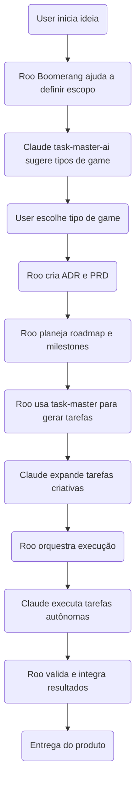
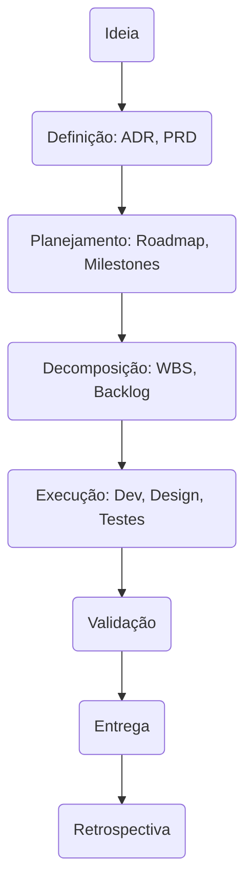
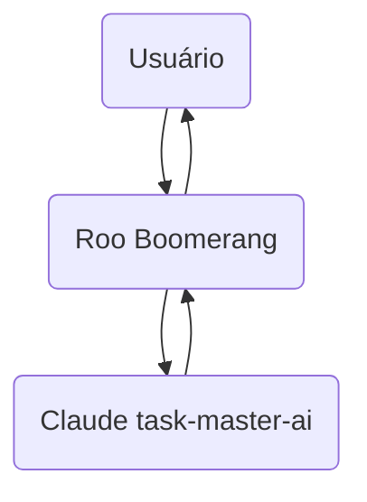

# Plano Detalhado de Integração

**Roo Boomerang + Claude task-master-ai**

---

## Sumário

- [1. Visão Geral](#1-visão-geral)
- [2. Frentes de Integração](#2-frentes-de-integração)
  - [2.1. Adaptações no Roo Boomerang](#21-adaptações-no-roo-boomerang)
  - [2.2. Adaptações no Claude task-master-ai](#22-adaptações-no-claude-task-master-ai)
- [3. Fluxo de Utilização Integrado](#3-fluxo-de-utilização-integrado)
- [4. Exemplo Prático: Criação Completa de um Game App](#4-exemplo-prático-criação-completa-de-um-game-app)
- [5. Conceitos e Etapas de Engenharia e Gestão de Projetos](#5-conceitos-e-etapas-de-engenharia-e-gestão-de-projetos)
- [6. Diagramas de Fluxo](#6-diagramas-de-fluxo)

---

## 1. Visão Geral

Este plano detalha como integrar **Roo Boomerang** (orquestrador multi-agente, transparente) com **Claude task-master-ai** (executor autônomo, criativo), para criar um sistema híbrido, flexível e auditável, que cobre desde a concepção da ideia até a entrega do produto.

---

## 2. Frentes de Integração

### 2.1. **Adaptações no Roo Boomerang**

- **Padronizar leitura e escrita no `tasks/tasks.json` e `/tasks/*.md`**
- **Invocar CLI `task-master`** para:
  - Criar tarefas (`add-task`)
  - Expandir tarefas (`expand`)
  - Atualizar status (`set-status`)
  - Analisar complexidade (`analyze-complexity`)
- **Delegar tarefas criativas para Claude** via CLI/API
- **Gerenciar ciclo completo**: decomposição, delegação, validação, integração
- **Gerar e manter documentação** (ADR, PRD, planos, etc)
- **Orquestrar fases do projeto**: concepção, planejamento, execução, validação
- **Registrar decisões e progresso** em arquivos compartilhados

---

### 2.2. **Adaptações no Claude task-master-ai**

- **Usar estrutura padrão de arquivos** (`tasks.json`, `/tasks/*.md`)
- **Aceitar comandos CLI do Roo** para criar/expandir tarefas
- **Atualizar arquivos de tarefas conforme execução**
- **Permitir chamadas via API ou CLI para integração transparente**
- **(Opcional)** Exportar logs/resultados para Roo validar
- **(Opcional)** Ajustar prompts para aceitar contexto do Roo

---

## 3. Fluxo de Utilização Integrado

---

## 4. Exemplo Prático: Criação Completa de um Game App

### **Etapas**

1. **Ideação**

   - Usuário: "Quero criar um game, mas não sei qual"
   - Roo Boomerang ativa Claude para sugerir gêneros (puzzle, RPG, shooter, etc)
   - Usuário escolhe "Puzzle casual para mobile"

2. **Definição**

   - Roo cria **ADR** (decisão: puzzle, plataforma mobile, Unity)
   - Roo cria **PRD** (requisitos: níveis, ranking, monetização, UX)

3. **Planejamento**

   - Roo define **roadmap** com **milestones** (MVP, Beta, Lançamento)
   - Roo cria **fases**: Design, Prototipagem, Desenvolvimento, Testes, Deploy
   - Roo usa task-master para gerar tarefas macro

4. **Decomposição**

   - Roo usa `task-master expand` para detalhar tarefas
   - Claude gera subtarefas criativas (ex: ideias de puzzles, mecânicas)

5. **Execução**

   - Roo orquestra tarefas técnicas (setup Unity, backend, UI)
   - Claude executa tarefas criativas (storyline, assets, diálogos)
   - Roo acompanha progresso, atualiza status

6. **Validação**

   - Roo ativa modo Debug para testes
   - Claude gera sugestões de melhorias
   - Roo integra feedbacks

7. **Entrega**
   - Roo gera documentação final
   - App publicado nas stores

---

## 5. Conceitos e Etapas de Engenharia e Gestão de Projetos

- **Ideação**: brainstorming, análise de mercado, definição de público-alvo
- **Análise de Viabilidade**: técnica, financeira, riscos
- **ADR (Architecture Decision Record)**: decisões técnicas e arquiteturais
- **PRD (Product Requirements Document)**: requisitos funcionais e não-funcionais
- **Roadmap**: cronograma macro, entregas principais
- **Milestones**: marcos importantes do projeto
- **WBS (Work Breakdown Structure)**: decomposição hierárquica das entregas
- **Backlog**: lista priorizada de tarefas
- **Sprint Planning**: planejamento de ciclos de trabalho
- **Task Breakdown**: detalhamento das tarefas
- **Execução**: desenvolvimento, design, testes
- **Validação**: QA, testes de usuário, revisões
- **Entrega**: deploy, publicação, handover
- **Documentação**: técnica, usuário, manutenção
- **Retrospectiva**: análise pós-projeto, lições aprendidas

---

## 6. Diagramas de Fluxo

### 6.1. Visão Macro do Processo

---

### 6.2. Integração Roo + Claude

---

## **Conclusão**

Este plano garante uma integração **transparente, auditável e eficiente** entre Roo Boomerang e Claude task-master-ai, cobrindo **todo o ciclo de vida do projeto**, desde a ideia até a entrega, com apoio a decisões, planejamento, execução e documentação.
