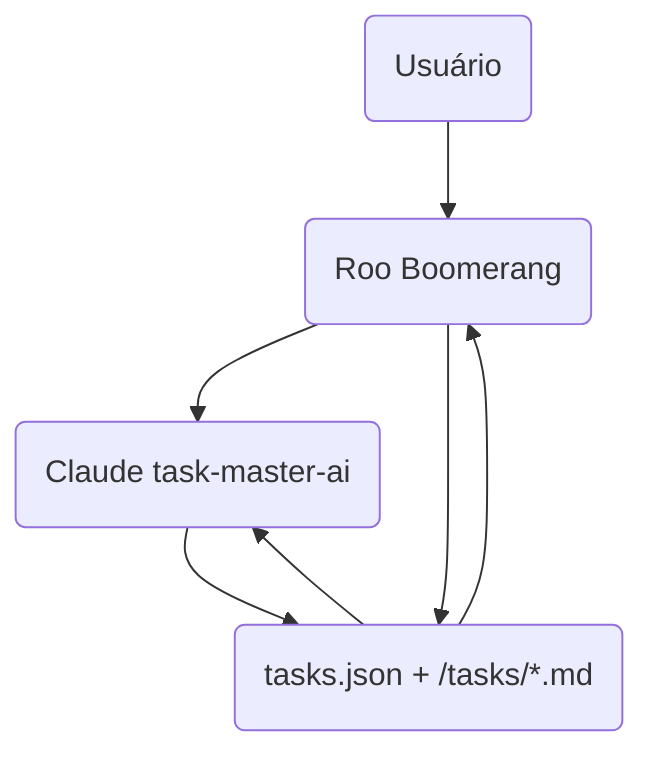
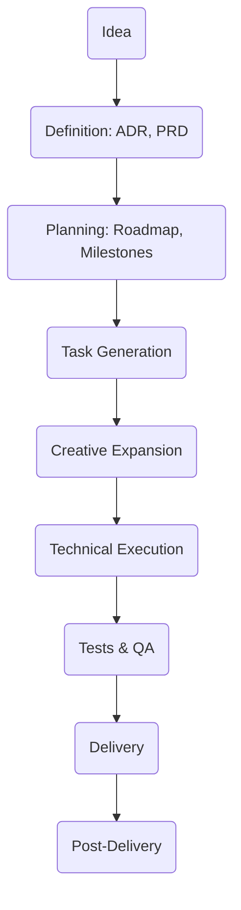

# Plano Avançado de Integração Roo Boomerang + Claude task-master-ai

**Deep Dive**

---

## Sumário

- [1. Visão Estratégica](#1-visão-estratégica)
- [2. Arquitetura Técnica Detalhada](#2-arquitetura-técnica-detalhada)
- [3. Frentes de Integração](#3-frentes-de-integração)
- [4. Casos de Uso Detalhados](#4-casos-de-uso-detalhados)
- [5. Pipeline Completo do Projeto (Game App)](#5-pipeline-completo-do-projeto-game-app)
- [6. Fluxos Técnicos e Diagramas](#6-fluxos-técnicos-e-diagramas)
- [7. Glossário e Conceitos](#7-glossário-e-conceitos)
- [8. Riscos, Limitações e Mitigações](#8-riscos-limitações-e-mitigações)
- [9. Recursos Exclusivos e Comuns](#9-recursos-exclusivos-e-comuns)
- [10. Recursos do Task Master](#10-recursos-do-task-master)

---

## 1. Visão Estratégica

- **Objetivo:** Criar um sistema híbrido que combine **controle explícito, auditável e multi-agente** (Roo Boomerang) com **autonomia criativa e rápida** (Claude task-master-ai).
- **Benefícios:**
  - Transparência + velocidade
  - Flexibilidade para tarefas técnicas e criativas
  - Padronização de tarefas e documentação
  - Orquestração multi-fase, multi-agente, multi-modal
- **Pilares:**
  - **Padronização**: arquivos, formatos, nomenclaturas
  - **Automação**: geração, expansão, execução, validação
  - **Auditabilidade**: logs, confirmações, versionamento
  - **Extensibilidade**: novos modos, agentes, integrações

---

## 2. Arquitetura Técnica Detalhada

### Componentes

- **Roo Boomerang Core**

  - Orquestrador multi-agente
  - Gerencia modos especializados
  - Invoca CLI `task-master`
  - Controla ciclo de vida das tarefas
  - Gera documentação (ADR, PRD, etc)

- **Claude task-master-ai**

  - CLI + API para criação, expansão, execução de tarefas
  - **A API MCP cobre um subconjunto das funcionalidades da CLI, focando em operações CRUD rápidas, enquanto a CLI oferece comandos avançados como parsing, geração, análise e automações.**
  - LLM-centric, autônomo
  - Atualiza `tasks.json` e `/tasks/*.md`
  - Gera subtarefas criativas

- **Repositório de Tarefas**

  - `tasks/tasks.json`: banco central
  - `/tasks/*.md`: tarefas detalhadas
  - Versionado via Git

- **Documentação**

  - `/docs/`: planos, ADRs, PRDs, retrospectivas
  - `/docs/roo-vs-taskmaster-comparativo.md`
  - `/docs/roo-taskmaster-integration-plan.md`

- **Configurações**
  - `.roomodes`, `.roo/mcp.json`, `.windsurfrules`, `.env`

---

## 3. Frentes de Integração

### 3.1. Adaptações no Roo Boomerang

- **Gerenciamento de tarefas via CLI `task-master`**
- **Parsing e validação do `tasks.json`**
- **Atualização incremental e segura**
- **Delegação inteligente** com heurísticas (complexidade, criatividade, criticidade) para decidir entre Claude e modos Roo
- **Orquestração multi-fase** (ideação, análise, planejamento, execução, validação, entrega)
- **Controle de contexto detalhado** para Claude
- **Logs e rastreabilidade detalhados**
- **Preservar delegação interna para modos especializados Roo** (Code, Architect, Debug, Ask)

---

### 3.2. Adaptações no Claude task-master-ai

- **Padronização de arquivos** para conformidade Roo
- **Expor APIs e CLI** para integração direta
- **Prompt engineering** para aceitar contexto detalhado
- **Retornar resultados estruturados**
- **Feedback loop** para status, logs, outputs
- **Permitir re-execução ou ajustes automáticos**

---

## 4. Casos de Uso Detalhados

### Caso 1: Ideação e Definição

- Usuário: "Quero criar um game, mas não sei qual"
- Roo ativa Claude para brainstorming
- Claude sugere gêneros, plataformas, tendências
- Roo organiza respostas, pede decisão
- Usuário escolhe "Puzzle casual para mobile"

---

### Caso 2: Geração de ADR e PRD

- Roo cria ADR (plataforma, engine, monetização)
- Roo cria PRD (funcionalidades, UX, KPIs)

---

### Caso 3: Planejamento e Tarefas

- Roo define milestones
- Roo usa task-master para criar tarefas macro
- Claude expande tarefas criativas
- Roo detalha tarefas técnicas

---

### Caso 4: Execução

- Roo orquestra tarefas técnicas via CLI
- Claude gera assets, diálogos, narrativa
- Roo valida entregas, atualiza status
- Claude sugere melhorias criativas

---

### Caso 5: Validação e Entrega

- Roo ativa modo Debug para testes
- Claude gera feedbacks criativos
- Roo integra, documenta, entrega

---

### Caso 6: Integração CLI + API

- Roo inicia projeto usando a CLI do task-master (`init`, `parse-prd`)
- Claude expande tarefas criativas via API MCP
- Roo consulta status e detalhes via API MCP (`listTasks`, `showTask`)
- Roo atualiza status e dependências via API MCP
- Claude sugere melhorias e expande subtarefas via API
- Roo integra resultados, valida e orquestra próximos passos

---

## 5. Pipeline Completo do Projeto (Game App)

| Fase                     | Atividades                                             | Responsável principal | Ferramentas/Modos                     |
| ------------------------ | ------------------------------------------------------ | --------------------- | ------------------------------------- |
| **Ideação**              | Brainstorm, análise mercado, definição público, gênero | Roo + Claude          | Claude (criatividade), Roo (controle) |
| **Decisão Arquitetural** | ADR: plataforma, engine, tech stack                    | Roo                   | Roo Architect Mode                    |
| **Requisitos**           | PRD: funcionalidades, UX, monetização, KPIs            | Roo                   | Roo Architect + Claude                |
| **Planejamento**         | Roadmap, milestones, WBS, backlog                      | Roo                   | Roo Architect + Code                  |
| **Geração de Tarefas**   | Criar tarefas macro, expandir em subtarefas            | Roo + Claude          | task-master CLI + Claude              |
| **Design Criativo**      | Storyline, assets, mecânicas, narrativa                | Claude                | Claude task-master-ai                 |
| **Desenvolvimento**      | Setup projeto, coding, integração, testes unitários    | Roo Code Mode         | Roo Code + task-master CLI            |
| **Testes & QA**          | Testes funcionais, UX, performance, segurança          | Roo Debug Mode        | Roo Debug + Claude                    |
| **Documentação**         | Técnicas, usuário, manutenção, retrospectiva           | Roo                   | Roo Architect + Ask                   |
| **Entrega**              | Deploy, publicação, handover                           | Roo                   | Roo Code + Architect                  |
| **Pós-Entrega**          | Feedback, melhorias, suporte                           | Roo + Claude          | Todos os modos                        |

---

## 6. Fluxos Técnicos e Diagramas

### Arquitetura Geral

---

### Pipeline Completo

---

## 7. Glossary and Concepts

### 7.1 Roles

| Category                                                 | Role                                       | Description                                                     |
| -------------------------------------------------------- | ------------------------------------------ | --------------------------------------------------------------- |
| Traditional Infrastructure                               | Network Administrator                      | Manages local networks, WAN, VPNs, and overall connectivity     |
| Traditional Infrastructure                               | Systems Administrator                      | Administers physical and virtual servers, operating systems     |
| Traditional Infrastructure                               | Technical Support Analyst                  | Resolves incidents, user support, and basic maintenance         |
| Traditional Infrastructure                               | Storage Administrator                      | Manages corporate storage, SAN, NAS                             |
| Traditional Infrastructure                               | Information Security Specialist            | Defines policies, monitors, and protects IT assets              |
| Traditional Infrastructure                               | Data Center Engineer                       | Responsible for the design and maintenance of physical data centers |
| Cloud Infrastructure                                     | Cloud Architect                            | Defines cloud solution architecture                             |
| Cloud Infrastructure                                     | Cloud Engineer                             | Implements and maintains cloud environments                     |
| Cloud Infrastructure                                     | Cloud Migration Specialist                 | Plans and executes system migrations to the cloud               |
| Cloud Infrastructure                                     | FinOps Specialist                          | Optimizes costs and resource usage in the cloud                 |
| Cloud Infrastructure                                     | Cloud Security Engineer                    | Ensures security in cloud environments                          |
| Cloud Infrastructure                                     | Cloud Operations Specialist                | Monitors and optimizes operations in cloud environments         |
| DevOps and Automation                                    | DevOps Engineer                            | Automates CI/CD pipelines, integrates development and operations|
| DevOps and Automation                                    | Site Reliability Engineer (SRE)            | Ensures reliability, scalability, and automation of systems     |
| DevOps and Automation                                    | Release Manager                            | Coordinates releases, versioning, and deployments               |
| DevOps and Automation                                    | Platform Engineer                          | Develops and maintains internal platforms for developers        |
| DevOps and Automation                                    | Infrastructure as Code Specialist          | Automates infrastructure via code (Terraform, Ansible, etc.)    |
| DevOps and Automation                                    | Automation Test Engineer                   | Creates and maintains automated test pipelines                  |
| Databases and Data                                       | Database Administrator (DBA)               | Manages relational databases, performance, backup, and security |
| Databases and Data                                       | Database Engineer                          | Develops and optimizes database solutions                       |
| Databases and Data                                       | NoSQL Database Specialist                  | Administers NoSQL databases (MongoDB, Cassandra, etc.)          |
| Databases and Data                                       | Data Warehouse Specialist                  | Designs and maintains data warehouses for BI                    |
| Databases and Data                                       | DataOps Engineer                           | Automates data pipelines, integration, and continuous delivery  |
| Databases and Data                                       | Data Steward                               | Ensures data governance and quality                             |
| Software Project - Management and Leadership             | Product Manager                            | Responsible for product vision, prioritization, and roadmap     |
| Software Project - Management and Leadership             | Project Manager                            | Manages schedule, budget, and project execution                 |
| Software Project - Management and Leadership             | Engineering Manager                        | Leads technical teams, development, and performance             |
| Software Project - Management and Leadership             | Scrum Master                               | Facilitates agile processes and removes impediments             |
| Software Project - Management and Leadership             | Delivery Manager                           | Ensures continuous deliveries aligned with business goals       |
| Software Project - Management and Leadership             | Program Manager                            | Coordinates multiple projects and strategic initiatives         |
| Software Project - Technical Development                 | Tech Lead                                  | Leads technical and architectural decisions                     |
| Software Project - Technical Development                 | Software Architect                         | Defines architecture of complex systems                         |
| Software Project - Technical Development                 | Developers (Backend, Frontend, Full Stack) | Implement features and integrations                             |
| Software Project - Technical Development                 | DevOps Engineer                            | Automates infrastructure and integrates operations              |
| Software Project - Technical Development                 | QA Engineer                                | Plans and executes tests to ensure quality                      |
| Software Project - Technical Development                 | Security Engineer                          | Implements and reviews application security                     |
| Software Project - Design and UX/UI                      | UX Designer                                | Focuses on user experience                                      |
| Software Project - Design and UX/UI                      | UI Designer                                | Creates attractive and functional visual interfaces             |
| Software Project - Design and UX/UI                      | Product Designer                           | Works on product conception, combining UX and UI                |
| Software Project - Data and Analytics                    | Data Engineer                              | Builds data pipelines and infrastructure                        |
| Software Project - Data and Analytics                    | Data Analyst                               | Analyzes data to generate insights and support decisions        |
| Software Project - Data and Analytics                    | Data Scientist                             | Develops predictive models and advanced analytics               |
| Software Project - Business and Support                  | Business Analyst                           | Gathers requirements and translates business needs              |
| Software Project - Business and Support                  | Stakeholder                                | Interested party who influences or is impacted by the project   |
| Software Project - Business and Support                  | Customer Success Manager                   | Ensures customer success and satisfaction after delivery        |
| Software Project - Operations and Infrastructure         | Site Reliability Engineer (SRE)            | Ensures reliability, scalability, and automation of systems     |
| Software Project - Operations and Infrastructure         | Infrastructure Engineer                    | Manages and optimizes technical infrastructure                  |
| Software Project - Technical Documentation and Communication | Technical Writer                       | Produces and maintains clear and accessible technical documentation |

### 7.2 Technical Terms

| Category                        | Term                        | Description                                                     |
| ------------------------------- | --------------------------- | --------------------------------------------------------------- |
| Documentation and Process       | ADR                         | Architecture Decision Record                                    |
| Documentation and Process       | PRD                         | Product Requirements Document                                   |
| Documentation and Process       | WBS                         | Work Breakdown Structure                                        |
| Documentation and Process       | Backlog                     | Prioritized list of tasks                                       |
| Documentation and Process       | Milestone                   | Important project milestone                                     |
| Documentation and Process       | Sprint                      | Iterative work cycle                                            |
| Documentation and Process       | MVP                         | Minimum Viable Product                                          |
| Documentation and Process       | Retrospective               | Post-project analysis                                           |
| Technology                      | LLM                         | Large Language Model                                            |
| Technology                      | CLI                         | Command Line Interface                                          |
| Technology                      | API                         | Application Programming Interface                               |
| General Management              | Scope                       | Definition of what will be delivered in the project             |
| General Management              | Schedule                    | Temporal planning of activities                                 |
| General Management              | Budget                      | Planning and control of project costs                           |
| General Management              | Stakeholders                | Parties interested in the project                               |
| General Management              | ROI                         | Return on investment                                            |
| General Management              | OKRs                        | Objectives and key results to measure success                   |
| General Management              | PMBOK                       | Guide to best practices in project management                   |
| Agile Methodologies             | Scrum                       | Agile framework based on sprints and defined roles              |
| Agile Methodologies             | Kanban                      | Agile method focused on continuous flow and work visualization  |
| Agile Methodologies             | Sprint                      | Fixed-time iteration for delivering increments                  |
| Agile Methodologies             | Backlog                     | Prioritized list of features and tasks                          |
| Agile Methodologies             | Daily                       | Daily meeting for team alignment                                |
| Agile Methodologies             | Retrospective               | Post-sprint analysis for continuous improvements                |
| Risk Management                 | Assessment                  | Identification and analysis of risks                            |
| Risk Management                 | Mitigation                  | Actions to reduce the probability or impact of risks            |
| Risk Management                 | Contingency                 | Alternative plans if the risk materializes                      |
| Quality and Testing             | QA                          | Product quality assurance                                       |
| Quality and Testing             | Tests (Unit, Integration, Acceptance) | Checks at different system levels                       |
| Quality and Testing             | CI/CD                       | Automated continuous integration and delivery                   |
| Technical Development           | Architecture                | Organizational structure of the system                          |
| Technical Development           | Microservices               | Architecture based on independent services                      |
| Technical Development           | API                         | Interface for communication between systems                     |
| Technical Development           | Refactoring                 | Code improvement without changing its behavior                  |
| Technical Development           | Technical Debt              | Technical commitments that need to be resolved in the future    |
| Infrastructure and Operations   | Cloud                       | Cloud computing                                                 |
| Infrastructure and Operations   | DevOps                      | Integration between development and operations                  |
| Infrastructure and Operations   | IaC                         | Infrastructure as Code, infrastructure automation               |
| Infrastructure and Operations   | Docker                      | Platform for creating containers                                |
| Infrastructure and Operations   | Kubernetes                  | Container orchestrator                                          |
| Monitoring and Indicators       | KPIs                        | Key performance indicators                                      |
| Monitoring and Indicators       | Dashboard                   | Visual dashboard for monitoring metrics                         |
| Monitoring and Indicators       | SLA                         | Service level agreement                                         |
| Monitoring and Indicators       | Observability               | Ability to understand the internal state of the system          |
| Product and UX                  | MVP                         | Minimum viable product for rapid validation                     |
| Product and UX                  | User Story                  | Description of a feature from the user's perspective            |
| Product and UX                  | Wireframe                   | Visual sketch of the user interface                             |
| Product and UX                  | Prototyping                 | Creation of prototypes for validating ideas                     |
| Communication and Collaboration | Transparency                | Clarity and openness in information and processes               |
| Communication and Collaboration | Feedback Loop               | Continuous cycle of feedback and improvement                    |
| Communication and Collaboration | Tools (Slack, Jira, Trello, Notion) | Platforms for communication and collaborative management    |
| Compliance and Security         | LGPD/GDPR                   | Data protection regulations                                     |
| Compliance and Security         | Cybersecurity               | Protection against digital threats and attacks                  |
| Compliance and Security         | Compliance                  | Compliance with standards, laws, and policies                   |

---

## 8. Riscos, Limitações e Mitigações

| Risco/Limitação                         | Mitigação                                                 |
| --------------------------------------- | --------------------------------------------------------- |
| Divergência entre arquivos Roo e Claude | Padronizar tasks.json + Markdown, validações automáticas  |
| Perda de contexto entre agentes         | Passar contexto detalhado, logs, histórico                |
| Decisões criativas desalinhadas         | Revisões manuais, prompts claros, validações Roo          |
| Complexidade excessiva                  | Modularização, fases bem definidas, automação incremental |
| Dependência excessiva do LLM            | Controle explícito Roo, fallback para execução manual     |
| Falhas na integração CLI/API            | Testes contínuos, logs detalhados, fallback manual        |
| Escalabilidade do fluxo                 | Modularização, paralelização, múltiplos agentes Claude    |

---

## 9. Recursos Exclusivos e Comuns

### Recursos exclusivos do **Boomerang**

- Multi-modo explícito, delegação via `new_task`
- Controle granular, confirmações iterativas
- Rastreabilidade detalhada, logs, síntese final
- Suporte a múltiplos MCP servers
- Geração e gestão de documentação (ADR, PRD)
- Orquestração multi-fase, multi-agente

---

### Recursos exclusivos do **task-master-ai**

- CLI completa para parsear PRD, gerar, expandir, listar, atualizar, fixar dependências
- Expansão automática baseada em complexidade
- Geração automática de tarefas a partir de PRD
- Suporte nativo a Perplexity AI
- Workflow AI-driven integrado com Cursor
- Atualização em lote com prompts
- Gestão automática de dependências
- Geração de arquivos individuais de tarefas
- Pipeline linear e rápido

---

### Recursos comuns

- Uso de Claude para geração e expansão
- Suporte a Perplexity AI
- Manipulação de tasks.json e arquivos Markdown
- Suporte a dependências entre tarefas
- Expansão de tarefas em subtarefas
- Atualização de status das tarefas
- Delegação para agentes especializados
- Suporte a automação de workflows

---

## 10. Recursos do **Task Master**

| **Descrição**                                   | **Comando CLI**         | **Parâmetros CLI**                                                                                                                              | **Recurso MCP**  | **Parâmetros MCP**                                                |
| ----------------------------------------------- | ----------------------- | ----------------------------------------------------------------------------------------------------------------------------------------------- | ---------------- | ----------------------------------------------------------------- |
| Inicializar novo projeto                        | `init`                  | `-y, --yes`, `-n, --name <name>`, `-d, --description <desc>`, `-v, --version <version>`, `-a, --author <author>`, `--skip-install`, `--dry-run` | _Não disponível_ | -                                                                 |
| Executar script dev.js                          | `dev`                   | _(nenhum)_                                                                                                                                      | _Não disponível_ | -                                                                 |
| Parsear PRD e gerar tasks.json                  | `parse-prd`             | `--input=<file.txt> [--tasks=10]`                                                                                                               | _Não disponível_ | -                                                                 |
| Gerar arquivos individuais de tarefas           | `generate`              | `[--options]`                                                                                                                                   | _Não disponível_ | -                                                                 |
| Listar todas as tarefas                         | `list`                  | `[--status=<status>] [--with-subtasks]`                                                                                                         | `listTasks`      | `status`, `withSubtasks`, `file`, `projectRoot`                   |
| Mostrar detalhes de uma tarefa                  | `show`                  | `<id>`                                                                                                                                          | `showTask`       | `id`, `file`, `projectRoot`                                       |
| Atualizar status de tarefas                     | `set-status`            | `--id=<id> --status=<status>`                                                                                                                   | `setTaskStatus`  | `id`, `status`, `file`, `projectRoot`                             |
| Atualizar tarefas com novo contexto             | `update`                | `--from=<id> --prompt="<context>"`                                                                                                              | _Não disponível_ | -                                                                 |
| Adicionar nova tarefa usando IA                 | `add-task`              | `--prompt="<text>" [--dependencies=1,2,3] [--priority=high]`                                                                                    | `addTask`        | `prompt`, `dependencies`, `priority`, `file`, `projectRoot`       |
| Expandir tarefas em subtarefas                  | `expand`                | `--id=<id> [--num=5] [--research] [--prompt="<context>"] [--force]`                                                                             | `expandTask`     | `id`, `num`, `research`, `prompt`, `force`, `file`, `projectRoot` |
| Expandir todas as tarefas pendentes             | `expand --all`          | `[--force] [--research]`                                                                                                                        | _Não disponível_ | -                                                                 |
| Analisar complexidade das tarefas               | `analyze-complexity`    | `[--research] [--threshold=5]`                                                                                                                  | _Não disponível_ | -                                                                 |
| Exibir relatório de complexidade                | `complexity-report`     | `[--file=<path>]`                                                                                                                               | _Não disponível_ | -                                                                 |
| Limpar subtarefas                               | `clear-subtasks`        | `--id=<id>`                                                                                                                                     | _Não disponível_ | -                                                                 |
| Adicionar subtask a uma tarefa                  | `add-subtask`           | `[--options]`                                                                                                                                   | _Não disponível_ | -                                                                 |
| Remover subtask de uma tarefa                   | `remove-subtask`        | `[--options]`                                                                                                                                   | _Não disponível_ | -                                                                 |
| Mostrar próxima tarefa a ser trabalhada         | `next`                  | _(nenhum)_                                                                                                                                      | `nextTask`       | `file`, `projectRoot`                                             |
| Adicionar dependência entre tarefas             | `add-dependency`        | `--id=<id> --depends-on=<id>`                                                                                                                   | _Não disponível_ | -                                                                 |
| Remover dependência entre tarefas               | `remove-dependency`     | `--id=<id> --depends-on=<id>`                                                                                                                   | _Não disponível_ | -                                                                 |
| Validar dependências (sem corrigir)             | `validate-dependencies` | _(nenhum)_                                                                                                                                      | _Não disponível_ | -                                                                 |
| Corrigir dependências inválidas automaticamente | `fix-dependencies`      | _(nenhum)_                                                                                                                                      | _Não disponível_ | -                                                                 |
| Exibir ajuda                                    | `help`                  | `[command]`                                                                                                                                     | _Não disponível_ | -                                                                 |

---

## **Resumo**

- **MCP cobre:** listagem, consulta, criação, expansão, status, próxima tarefa.
- **CLI oferece comandos adicionais** para:
  - Inicialização, parsing PRD, geração de arquivos
  - Análise e relatório de complexidade
  - Gerenciamento de subtarefas
  - Validação e correção de dependências
  - Atualizações em lote com contexto
  - Execução de scripts meta (`dev`)
- Para integração completa, **usar MCP para operações CRUD rápidas** e **CLI para inicialização, parsing, geração, análise, dependências e automações avançadas**.
