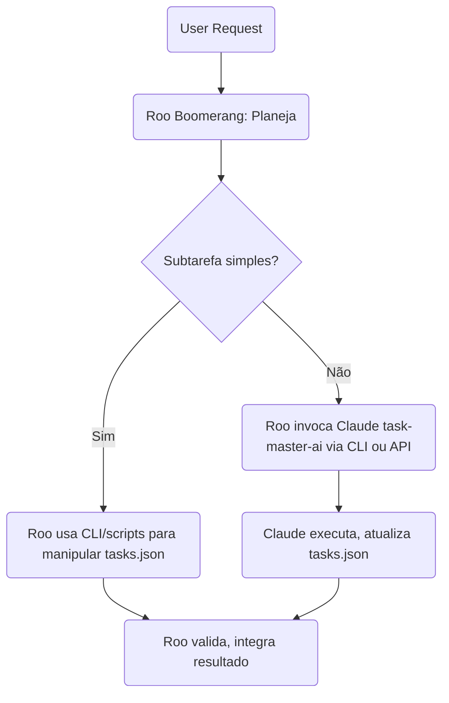
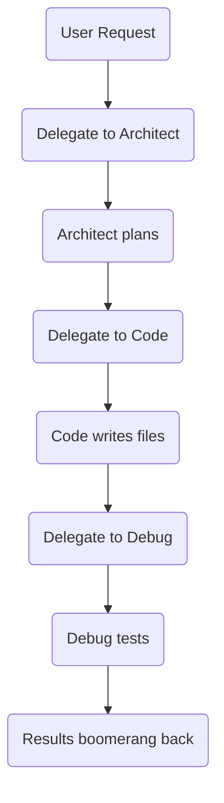
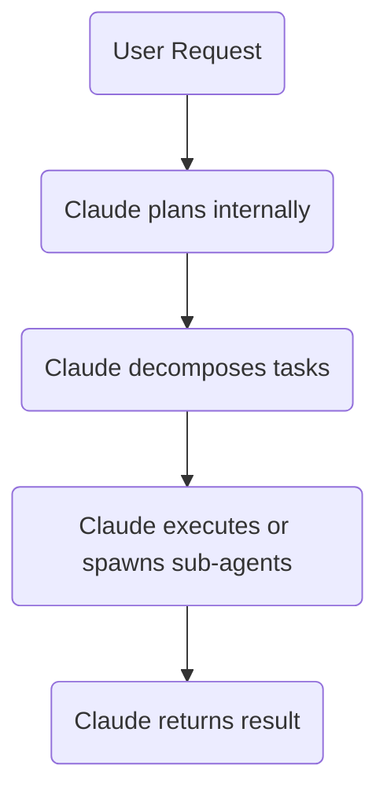

# Integração Roo Boomerang + Claude task-master-ai

---

## Sumário

- [1. Comparativo Geral](#1-comparativo-geral)
- [2. Plano de Integração](#2-plano-de-integração)
- [3. Comparativo Metodologias e Fluxos](#3-comparativo-metodologias-e-fluxos)
- [4. Comparativo Estrutura de Arquivos](#4-comparativo-estrutura-de-arquivos)
- [5. Diagramas de Fluxo](#5-diagramas-de-fluxo)

---

## 1. Comparativo Geral

| Aspecto          | **Roo Boomerang Tasks**                          | **Claude task-master-ai**                           |
| ---------------- | ------------------------------------------------ | --------------------------------------------------- |
| Paradigma        | Orquestração explícita, multi-modo, multi-agente | Autonomia LLM-centric, recursiva                    |
| Transparência    | Alta, confirmações iterativas                    | Média, decisões internas do LLM                     |
| Controle         | Fino, explícito, passo a passo                   | Mais autônomo, menos granular                       |
| Delegação        | Multi-modo, delega a especialistas               | Claude decide internamente ou via CLI expand        |
| User-in-the-loop | Forte, usuário pode intervir a cada passo        | Fraco, usuário intervém mais no início e no fim     |
| Foco             | Precisão, auditabilidade, workflows complexos    | Velocidade, autonomia, geração criativa             |
| Extensibilidade  | Alta (novos modos, ferramentas, MCP servers)     | Média (via prompts, integrações Claude)             |
| Ideal para       | Workflows complexos, críticos, multi-etapas      | Automação rápida, tarefas criativas, menos críticas |

---

## 2. Plano de Integração

- **Usar Roo Boomerang como orquestrador principal**
- **Padronizar tasks.json + `/tasks/*.md` como fonte única de tarefas**
- Roo **invoca CLI `task-master`** para criar, expandir, atualizar tarefas
- Roo **delegará tarefas criativas para Claude task-master-ai** via CLI/API
- Ambos **usam os mesmos arquivos**, garantindo sincronia
- Roo **valida, integra e orquestra próximos passos**

---

## 3. Comparativo Metodologias e Fluxos

| Aspecto                | **Roo Boomerang Tasks**                          | **Claude task-master-ai**                       |
| ---------------------- | ------------------------------------------------ | ----------------------------------------------- |
| Paradigma              | Orquestração explícita, multi-modo, multi-agente | Autonomia LLM-centric, recursiva                |
| Decomposição           | Divide tarefas, delega a modos especializados    | Claude decompõe e executa internamente          |
| Delegação              | Usa `new_task` para subtarefas                   | Claude decide internamente ou via CLI expand    |
| Controle               | Passos explícitos, confirmações iterativas       | Mais autônomo, menos confirmações explícitas    |
| Transparência          | Alta, logs e confirmações                        | Média, decisões internas do LLM                 |
| Ferramentas            | Invoca ferramentas específicas, CLI, APIs        | Usa CLI `task-master` e chamadas Claude         |
| User-in-the-loop       | Forte, usuário pode intervir                     | Fraco, usuário intervém mais no início e no fim |
| Expansão de tarefas    | Manual ou delegada a modo especializado          | Automática via `task-master expand` com Claude  |
| Atualização de tarefas | Explícita, controlada                            | Automática via CLI ou API                       |
| Verificação            | Explícita, pode envolver modo Debug              | Menos explícita, depende do fluxo               |

---

## 4. Comparativo Estrutura de Arquivos

| Aspecto                    | **Roo Boomerang Tasks**                         | **Claude task-master-ai**                              |
| -------------------------- | ----------------------------------------------- | ------------------------------------------------------ |
| Arquivo central de tarefas | Flexível (JSON, YAML, Markdown)                 | `tasks/tasks.json` (JSON estruturado)                  |
| Arquivos de tarefas indiv. | Pode usar qualquer formato                      | `/tasks/*.md` (Markdown estruturado)                   |
| Diretório principal        | Configurável, geralmente `/tasks/`              | `/tasks/`                                              |
| Configuração de modos      | `.roomodes`                                     | Não possui equivalente                                 |
| Configuração MCP           | `.roo/mcp.json`                                 | `.env` para API keys                                   |
| Regras e fluxo             | `.windsurfrules`                                | `.windsurfrules`                                       |
| Variáveis ambiente         | `.env`                                          | `.env`                                                 |
| Scripts CLI                | Pode invocar qualquer script                    | `scripts/dev.js` ou CLI `task-master`                  |
| CLI principal              | Não possui CLI próprio, usa ferramentas e modos | `task-master` (global ou via `npx`)                    |
| Expansão de tarefas        | Via delegação ou CLI externo                    | `task-master expand`, `task-master analyze-complexity` |
| Atualização de tarefas     | Via delegação ou edição direta                  | `task-master update`, `task-master set-status`         |

---

## 5. Diagramas de Fluxo

### 5.1. Fluxo Híbrido Roo + Claude

---

### 5.2. Fluxo Roo Boomerang Puro

---

### 5.3. Fluxo Claude task-master-ai Puro

---

## Conclusão

- **Roo Boomerang** oferece **controle, transparência e orquestração multi-agente**
- **Claude task-master-ai** oferece **autonomia, velocidade e criatividade**
- A integração ideal é **usar Roo como orquestrador principal**, delegando tarefas criativas para Claude, **compartilhando a mesma base de tarefas** (`tasks.json` + `/tasks/*.md`)
