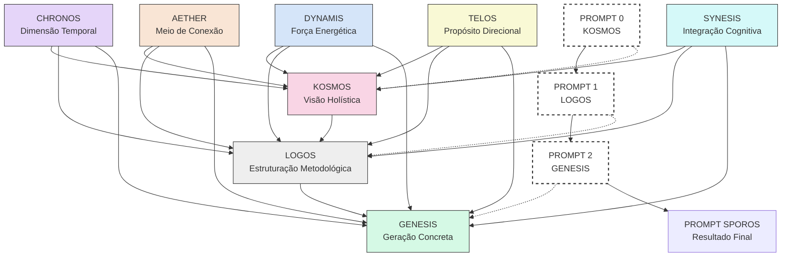
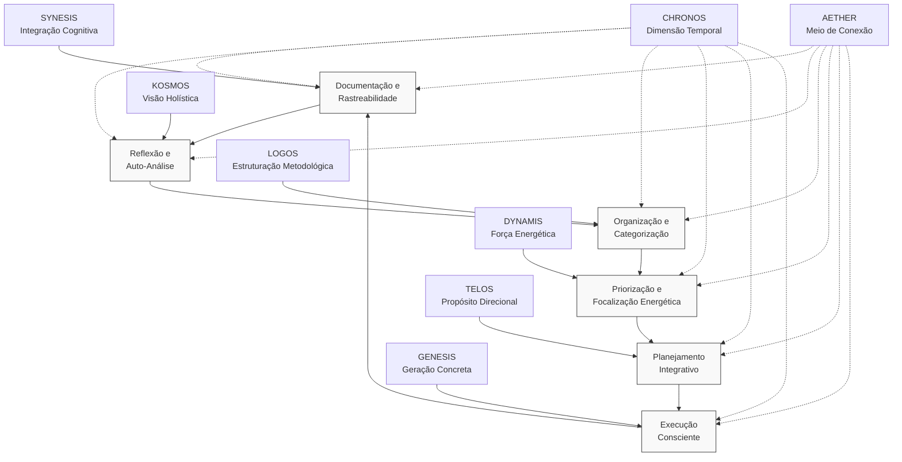
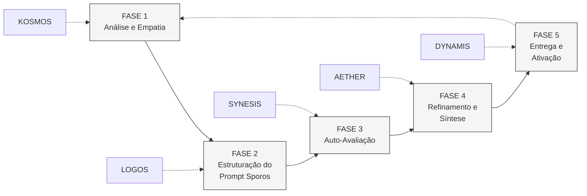

# Diagrama Visual do Framework Kosmologogenesis

## Estrutura Octádica e Interconexões

```mermaid
graph TD
    classDef kosmos fill:#f9d5e5,stroke:#333,stroke-width:1px
    classDef logos fill:#eeeeee,stroke:#333,stroke-width:1px
    classDef genesis fill:#d5f9e5,stroke:#333,stroke-width:1px
    classDef chronos fill:#e5d5f9,stroke:#333,stroke-width:1px
    classDef aether fill:#f9e5d5,stroke:#333,stroke-width:1px
    classDef dynamis fill:#d5e5f9,stroke:#333,stroke-width:1px
    classDef telos fill:#f9f9d5,stroke:#333,stroke-width:1px
    classDef synesis fill:#d5f9f9,stroke:#333,stroke-width:1px
    classDef prompt fill:#ffffff,stroke:#333,stroke-width:2px,stroke-dasharray: 5 5

    KOSMOS[KOSMOS<br>Visão Holística] --> LOGOS[LOGOS<br>Estruturação Metodológica]
    LOGOS --> GENESIS[GENESIS<br>Geração Concreta]
    
    CHRONOS[CHRONOS<br>Dimensão Temporal] --> KOSMOS
    CHRONOS --> LOGOS
    CHRONOS --> GENESIS
    
    AETHER[AETHER<br>Meio de Conexão] --> KOSMOS
    AETHER --> LOGOS
    AETHER --> GENESIS
    
    DYNAMIS[DYNAMIS<br>Força Energética] --> KOSMOS
    DYNAMIS --> LOGOS
    DYNAMIS --> GENESIS
    
    TELOS[TELOS<br>Propósito Direcional] --> KOSMOS
    TELOS --> LOGOS
    TELOS --> GENESIS
    
    SYNESIS[SYNESIS<br>Integração Cognitiva] --> KOSMOS
    SYNESIS --> LOGOS
    SYNESIS --> GENESIS
    
    PROMPT0[PROMPT 0<br>KOSMOS] --> PROMPT1[PROMPT 1<br>LOGOS]
    PROMPT1 --> PROMPT2[PROMPT 2<br>GENESIS]
    
    PROMPT0 -.-> KOSMOS
    PROMPT1 -.-> LOGOS
    PROMPT2 -.-> GENESIS
    
    SPOROS[PROMPT SPOROS<br>Resultado Final]
    
    PROMPT2 --> SPOROS
    
    class KOSMOS kosmos
    class LOGOS logos
    class GENESIS genesis
    class CHRONOS chronos
    class AETHER aether
    class DYNAMIS dynamis
    class TELOS telos
    class SYNESIS synesis
    class PROMPT0 prompt
    class PROMPT1 prompt
    class PROMPT2 prompt
```

## Ciclo de Evolução Consciente

```mermaid
flowchart TD
    classDef phase fill:#f9f9f9,stroke:#333,stroke-width:1px
    
    A[Documentação e<br>Rastreabilidade] --> B[Reflexão e<br>Auto-Análise]
    B --> C[Organização e<br>Categorização]
    C --> D[Priorização e<br>Focalização Energética]
    D --> E[Planejamento<br>Integrativo]
    E --> F[Execução<br>Consciente]
    F --> A
    
    SYNESIS[SYNESIS<br>Integração Cognitiva] --> A
    KOSMOS[KOSMOS<br>Visão Holística] --> B
    LOGOS[LOGOS<br>Estruturação Metodológica] --> C
    DYNAMIS[DYNAMIS<br>Força Energética] --> D
    TELOS[TELOS<br>Propósito Direcional] --> E
    GENESIS[GENESIS<br>Geração Concreta] --> F
    CHRONOS[CHRONOS<br>Dimensão Temporal] -.-> A
    CHRONOS -.-> B
    CHRONOS -.-> C
    CHRONOS -.-> D
    CHRONOS -.-> E
    CHRONOS -.-> F
    AETHER[AETHER<br>Meio de Conexão] -.-> A
    AETHER -.-> B
    AETHER -.-> C
    AETHER -.-> D
    AETHER -.-> E
    AETHER -.-> F
    
    class A phase
    class B phase
    class C phase
    class D phase
    class E phase
    class F phase
```

## Fases do Processo

```mermaid
graph LR
    classDef phase fill:#f5f5f5,stroke:#333,stroke-width:1px
    
    A[FASE 1<br>Análise e Empatia] --> B[FASE 2<br>Estruturação do<br>Prompt Sporos]
    B --> C[FASE 3<br>Auto-Avaliação]
    C --> D[FASE 4<br>Refinamento e<br>Síntese]
    D --> E[FASE 5<br>Entrega e<br>Ativação]
    E -.-> A
    
    KOSMOS[KOSMOS] -.-> A
    LOGOS[LOGOS] -.-> B
    SYNESIS[SYNESIS] -.-> C
    AETHER[AETHER] -.-> D
    DYNAMIS[DYNAMIS] -.-> E
    
    class A phase
    class B phase
    class C phase
    class D phase
    class E phase
```
