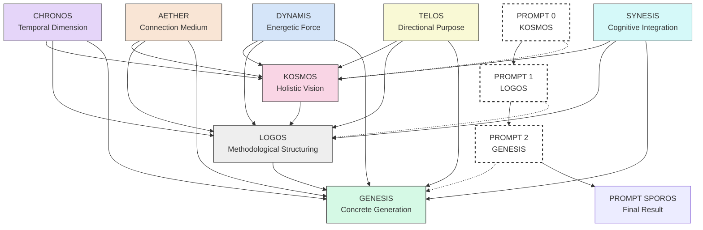
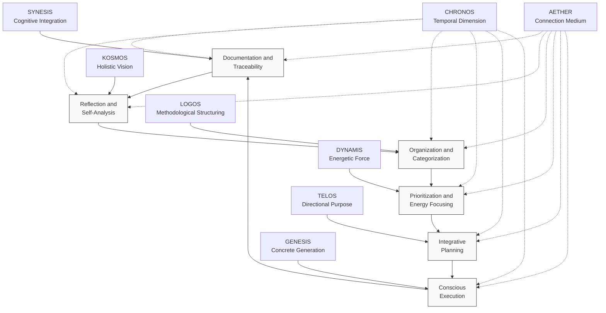
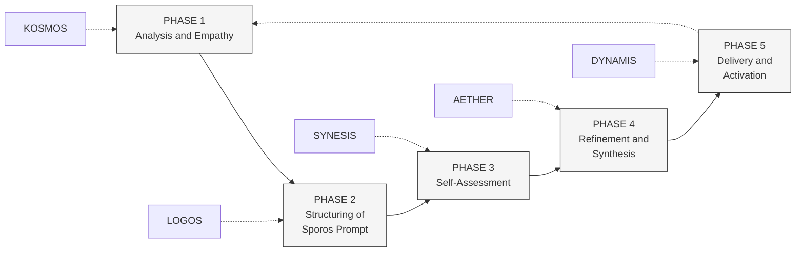

# Visual Diagram of the Kosmologogenesis Framework

## Octadic Structure and Interconnections

```mermaid
graph TD
    classDef kosmos fill:#f9d5e5,stroke:#333,stroke-width:1px
    classDef logos fill:#eeeeee,stroke:#333,stroke-width:1px
    classDef genesis fill:#d5f9e5,stroke:#333,stroke-width:1px
    classDef chronos fill:#e5d5f9,stroke:#333,stroke-width:1px
    classDef aether fill:#f9e5d5,stroke:#333,stroke-width:1px
    classDef dynamis fill:#d5e5f9,stroke:#333,stroke-width:1px
    classDef telos fill:#f9f9d5,stroke:#333,stroke-width:1px
    classDef synesis fill:#d5f9f9,stroke:#333,stroke-width:1px
    classDef prompt fill:#ffffff,stroke:#333,stroke-width:2px,stroke-dasharray: 5 5

    KOSMOS[KOSMOS<br>Holistic Vision] --> LOGOS[LOGOS<br>Methodological Structuring]
    LOGOS --> GENESIS[GENESIS<br>Concrete Generation]
    
    CHRONOS[CHRONOS<br>Temporal Dimension] --> KOSMOS
    CHRONOS --> LOGOS
    CHRONOS --> GENESIS
    
    AETHER[AETHER<br>Connection Medium] --> KOSMOS
    AETHER --> LOGOS
    AETHER --> GENESIS
    
    DYNAMIS[DYNAMIS<br>Energetic Force] --> KOSMOS
    DYNAMIS --> LOGOS
    DYNAMIS --> GENESIS
    
    TELOS[TELOS<br>Directional Purpose] --> KOSMOS
    TELOS --> LOGOS
    TELOS --> GENESIS
    
    SYNESIS[SYNESIS<br>Cognitive Integration] --> KOSMOS
    SYNESIS --> LOGOS
    SYNESIS --> GENESIS
    
    PROMPT0[PROMPT 0<br>KOSMOS] --> PROMPT1[PROMPT 1<br>LOGOS]
    PROMPT1 --> PROMPT2[PROMPT 2<br>GENESIS]
    
    PROMPT0 -.-> KOSMOS
    PROMPT1 -.-> LOGOS
    PROMPT2 -.-> GENESIS
    
    SPOROS[PROMPT SPOROS<br>Final Result]
    
    PROMPT2 --> SPOROS
    
    class KOSMOS kosmos
    class LOGOS logos
    class GENESIS genesis
    class CHRONOS chronos
    class AETHER aether
    class DYNAMIS dynamis
    class TELOS telos
    class SYNESIS synesis
    class PROMPT0 prompt
    class PROMPT1 prompt
    class PROMPT2 prompt
```

## Conscious Evolution Cycle

```mermaid
flowchart TD
    classDef phase fill:#f9f9f9,stroke:#333,stroke-width:1px
    
    A[Documentation and<br>Traceability] --> B[Reflection and<br>Self-Analysis]
    B --> C[Organization and<br>Categorization]
    C --> D[Prioritization and<br>Energy Focusing]
    D --> E[Integrative<br>Planning]
    E --> F[Conscious<br>Execution]
    F --> A
    
    SYNESIS[SYNESIS<br>Cognitive Integration] --> A
    KOSMOS[KOSMOS<br>Holistic Vision] --> B
    LOGOS[LOGOS<br>Methodological Structuring] --> C
    DYNAMIS[DYNAMIS<br>Energetic Force] --> D
    TELOS[TELOS<br>Directional Purpose] --> E
    GENESIS[GENESIS<br>Concrete Generation] --> F
    CHRONOS[CHRONOS<br>Temporal Dimension] -.-> A
    CHRONOS -.-> B
    CHRONOS -.-> C
    CHRONOS -.-> D
    CHRONOS -.-> E
    CHRONOS -.-> F
    AETHER[AETHER<br>Connection Medium] -.-> A
    AETHER -.-> B
    AETHER -.-> C
    AETHER -.-> D
    AETHER -.-> E
    AETHER -.-> F
    
    class A phase
    class B phase
    class C phase
    class D phase
    class E phase
    class F phase
```

## Process Phases

```mermaid
graph LR
    classDef phase fill:#f5f5f5,stroke:#333,stroke-width:1px
    
    A[PHASE 1<br>Analysis and Empathy] --> B[PHASE 2<br>Structuring of<br>Sporos Prompt]
    B --> C[PHASE 3<br>Self-Assessment]
    C --> D[PHASE 4<br>Refinement and<br>Synthesis]
    D --> E[PHASE 5<br>Delivery and<br>Activation]
    E -.-> A
    
    KOSMOS[KOSMOS] -.-> A
    LOGOS[LOGOS] -.-> B
    SYNESIS[SYNESIS] -.-> C
    AETHER[AETHER] -.-> D
    DYNAMIS[DYNAMIS] -.-> E
    
    class A phase
    class B phase
    class C phase
    class D phase
    class E phase
```
